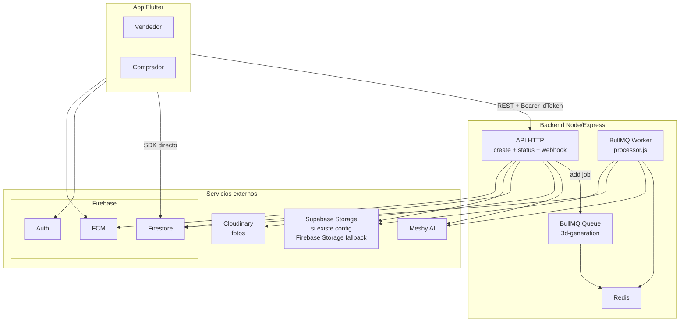
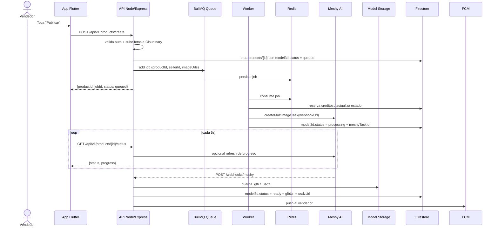

# Arquitectura

## Vista general

> Diagrama editable visualmente: [`architecture.drawio`](architecture.drawio) (abrelo en [app.diagrams.net](https://app.diagrams.net) o con la extension "Draw.io Integration" de VS Code).

Hay dos canales desde la app:

1. **Backend REST** para publicar productos, encolar la generacion 3D y consultar progreso.
2. **Firebase SDK directo** para catalogo, favoritos, solicitudes y perfil.

La diferencia importante frente a una arquitectura "solo API" es que aqui el backend no procesa todo inline. La generacion 3D se desacopla usando **BullMQ + Redis**, con una cola compartida y al menos un worker consumidor.

## Responsabilidades por capa

### Cliente Flutter

| Capa | Archivo | Responsabilidad |
|---|---|---|
| Entry | `main.dart` | Bootstrap Firebase, construye `MultiProvider`, decide `demoMode` si Firebase no inicializa. |
| Tema | `theme/app_theme.dart` | Material 3, colores, estilos de botones. |
| Modelos | `models/product.dart`, `models/product_listing.dart` | DTOs entre cliente, backend y Firestore. |
| Servicios | `services/*.dart` | Clientes a APIs externas y al backend. |
| Estado | `providers/*.dart` | `ChangeNotifier` por dominio. |
| UI | `screens/*.dart`, `widgets/*.dart` | Pantallas y componentes reusables. |

### Backend Node/Express

El backend ya esta incluido en este proyecto bajo `meshy-worker/`. No vive "en otro repo" para este snapshot del proyecto.

Piezas principales:

- `src/server.js`: API HTTP, healthcheck, rutas REST y webhook
- `src/services/queue.js`: conexion Redis y cola BullMQ `3d-generation`
- `src/workers/processor.js`: worker que consume jobs y crea tareas en Meshy
- `src/routes/products.js`: crea productos, encola jobs y expone status
- `src/routes/webhooks.js`: recibe callback de Meshy y finaliza el modelo

## Flujo de datos del modelo 3D

## Contrato actual de endpoints

- `POST /api/v1/products/create`
  - requiere `Authorization: Bearer <Firebase idToken>`
  - sube fotos, crea documento en Firestore y encola el job BullMQ

- `GET /api/v1/products/{id}/status`
  - el cliente hoy tambien envia `Authorization` si tiene sesion
  - **pero el backend actual no lo exige**
  - devuelve estado, progreso y URLs del modelo si ya esta listo

Esta diferencia importa: desde el punto de vista del cliente, ambos viajan por el mismo `ApiClient`; desde el punto de vista del backend, solo `create` esta protegido hoy.

## Storage real del sistema

- **Fotos originales**: Cloudinary
- **Modelos 3D**:
  - Supabase Storage si existen `SUPABASE_URL`, `SUPABASE_SECRET_KEY` y `SUPABASE_STORAGE_BUCKET`
  - Firebase Storage como fallback si esa configuracion no existe

Por eso la arquitectura real no depende de un solo proveedor para `.glb` y `.usdz`.

## BullMQ y Redis

BullMQ no es un detalle de implementacion menor aqui; es parte de la arquitectura:

- la API agrega jobs a la cola `3d-generation`
- Redis persiste la cola y su estado
- el worker procesa en background con retries y backoff exponencial
- el job usa `jobId = productId`, lo que ayuda a evitar duplicados logicos por producto

Configuracion visible hoy:

- `attempts: 3`
- `backoff` exponencial con delay inicial de 15s
- `concurrency: 2`
- `limiter: max 10 por minuto`

## Topologia de procesos

En local, `docker-compose.yml` levanta:

- `redis`
- `api`
- `worker`

Ademas, `src/server.js` importa el worker inline salvo que `RUN_WORKER_INLINE === 'false'`. Eso significa que la arquitectura efectiva puede ser:

- API + worker inline en el mismo proceso
- worker dedicado en proceso aparte
- o ambos a la vez, si no se configura con cuidado

Para documentacion conceptual conviene pensar en **API** y **worker** como roles separados, aunque en ciertos despliegues compartan proceso.

## Decisiones arquitectonicas

### Por que Firebase SDK directo para lecturas

- tiempo real con `snapshots()`
- menos endpoints para operaciones triviales
- reglas de seguridad en Firestore

### Por que BullMQ en vez de procesar inline

- publicar producto responde rapido
- la generacion 3D tarda minutos y depende de APIs externas
- se pueden aplicar retries, backoff y limites de concurrencia
- desacopla el request HTTP del trabajo pesado

### Por que webhook + polling

- Meshy notifica finalizacion por webhook
- el cliente hace polling a tu backend para progreso y estado visible
- el backend puede refrescar progreso desde Meshy cuando hace falta, sin exponer Meshy al cliente
