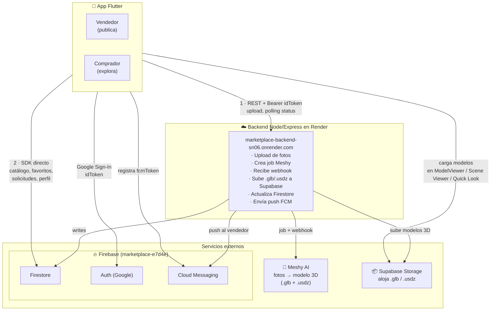
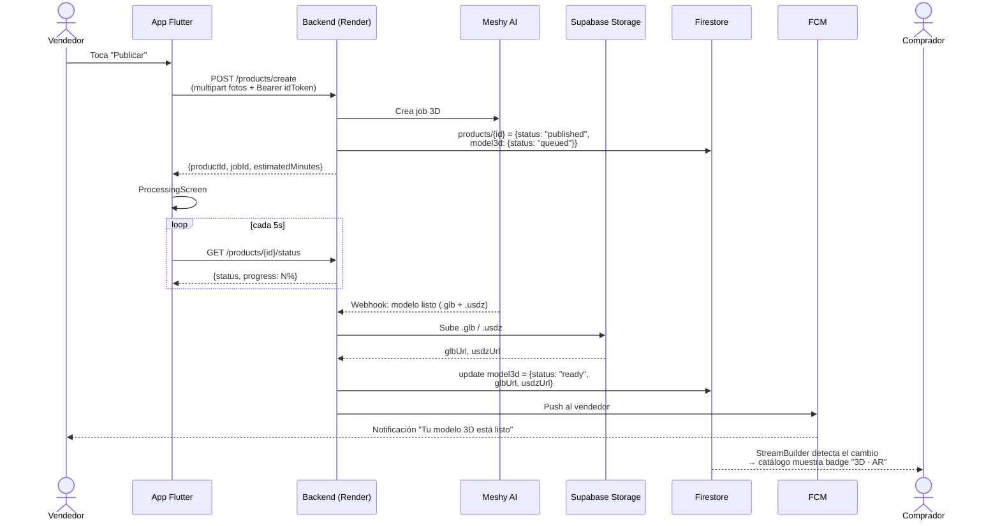

# Arquitectura

## Vista general

> Diagrama editable visualmente: [`architecture.drawio`](architecture.drawio) (ábrelo en [app.diagrams.net](https://app.diagrams.net) o con la extensión "Draw.io Integration" de VS Code).

Hay **dos canales** desde la app:

1. **Backend (REST)** — para acciones que requieren trabajo del servidor (upload de fotos, encolar Meshy, consultar progreso del modelo 3D).
2. **Firebase SDK directo** — para todo lo que es lectura/escritura simple sobre Firestore (catálogo, favoritos, solicitudes de compra, mis productos). Esto evita endpoints triviales y aprovecha actualizaciones en tiempo real con `StreamBuilder`.

## Responsabilidades por capa

### Cliente Flutter

| Capa | Archivo | Responsabilidad |
|---|---|---|
| Entry | `main.dart` | Bootstrap Firebase, construye `MultiProvider`, decide `demoMode` si Firebase no inicializa. |
| Tema | `theme/app_theme.dart` | Material 3, colores, estilos de botones. |
| Modelos | `models/product.dart`, `models/product_listing.dart` | DTOs entre cliente, backend y Firestore. |
| Servicios | `services/*.dart` | Clientes a APIs externas (Dio, FirebaseAuth, FCM, AR launcher, image_picker). |
| Estado | `providers/*.dart` | `ChangeNotifier` por dominio (auth, seller). UI lo consume con `Consumer`/`context.read`. |
| UI | `screens/*.dart`, `widgets/*.dart` | Pantallas y componentes reusables. |

### Backend (Render)

> El backend vive en otro repositorio. Aquí dejamos lo que el cliente espera de él.

Endpoints conocidos:

- `POST /api/v1/products/create` — multipart con `title`, `description`, `price`, `category`, `photos[]`. Devuelve `{productId, jobId, productStatus, estimatedMinutes}`.
- `GET /api/v1/products/{id}/status` — devuelve `{productId, productStatus, status, progress, glbUrl?, usdzUrl?, error?, errorDetail?}`.

Ambos requieren header `Authorization: Bearer <Firebase idToken>`. El cliente lo agrega en `AuthProvider._syncSession` al loguearse.

### Servicios externos

Detalles en [`services.md`](services.md).

- **Meshy AI**: convierte 2-4 fotos en un modelo 3D (`.glb` + `.usdz`) en 1-3 minutos.
- **Supabase Storage**: aloja los archivos `.glb` y `.usdz` resultantes; el backend devuelve URLs públicas que el cliente abre en `ModelViewer` y en Scene Viewer/Quick Look.
- **Firebase Firestore**: catálogo, favoritos, solicitudes, FCM tokens.
- **Firebase Auth**: login con Google.
- **Firebase Cloud Messaging**: push al vendedor cuando el modelo queda listo.

## Flujo de datos del modelo 3D

## Por qué cada tecnología

### Flutter (cliente)

Una sola base de código para Android e iOS con UI nativa-like y hot reload. Para un marketplace donde el diferenciador es la experiencia 3D/AR, mantener dos apps nativas en paralelo era costo muerto. Flutter además tiene `model_viewer_plus` (renderer 3D inline) y se integra bien con los visores AR nativos del sistema operativo vía deep links, así que no perdemos AR por ser multiplataforma.

### Node.js + Express (backend)

El backend hace tres cosas: validar tokens de Firebase, hablar con Meshy (HTTP/webhooks) y subir archivos a Supabase. Es I/O puro, sin CPU pesada. Node + Express es el camino más corto: ecosistema enorme, `firebase-admin` oficial, `multer` para multipart, deploy a Render en minutos. No hay nada en el dominio que justifique algo más complejo (Go, Rust, Java).

### Firebase Firestore (base de datos)

Elegido por tres razones concretas:

- **Tiempo real sin infra extra.** `snapshots()` en `StreamBuilder` actualiza el catálogo y el estado del modelo 3D sin polling ni websockets propios. Cuando el backend escribe `model3d.status = "ready"`, todos los compradores que tengan el detalle abierto ven el badge "3D · AR" aparecer solo.
- **Reglas en el servidor, no en el cliente.** La autorización vive en `firestore.rules` validando `request.auth.uid`. Esto nos permite que el cliente lea/escriba Firestore directamente sin pasar por el backend para operaciones triviales (favoritos, solicitudes, perfil).
- **Free tier suficiente** para la fase actual del proyecto. No pagamos por base de datos hasta tener tracción real.

Trade-off conocido: queries con varios `where + orderBy` requieren índices compuestos que hay que crear a mano (Firebase loguea el link). Lo asumimos porque el modelo de datos es estable.

### Firebase Auth + Google Sign-In

- **Cero gestión de contraseñas, recuperación, verificación de email.** Todo lo absorbe Google.
- **El `idToken` que emite Firebase Auth es JWT firmado**, así que el backend lo valida con `firebase-admin` sin tener que consultar nuestra base. Es la pieza que une cliente y backend: el cliente lo manda como `Authorization: Bearer ...` y el backend obtiene el `uid` del vendedor de forma confiable.
- **Solo Google como proveedor** porque el público objetivo ya tiene cuenta Google en el dispositivo (Android sobre todo) y simplifica el onboarding a un tap.
- Usamos `idTokenChanges()` (no `authStateChanges()`) para que el cliente refresque el token cuando expira (cada hora) sin que el usuario lo note.

### Firebase Cloud Messaging (FCM)

Es el servicio de **push notifications** de Google para Android e iOS. Lo usamos para un caso específico: avisar al **vendedor** cuando su modelo 3D queda listo (Meshy tarda 1–3 min y la app puede estar cerrada en ese rato).

Cómo funciona aquí:
1. Al loguearse, el cliente llama a `PushService.registerForUser(uid)` que pide permisos, obtiene un token único del dispositivo y lo guarda en `users/{uid}.fcmTokens` (array, para soportar varios dispositivos por usuario).
2. Cuando el webhook de Meshy llega al backend, este lee los tokens del seller desde Firestore y envía el push vía FCM.
3. Al cerrar sesión, el token se quita con `arrayRemove` para no notificar a dispositivos ajenos.

Lo elegimos sobre alternativas (OneSignal, Pusher) porque ya estábamos en Firebase: cero credenciales nuevas, cero billing extra.

### Supabase Storage (modelos 3D)

Los archivos `.glb` y `.usdz` que produce Meshy pesan 2–10 MB cada uno y se sirven públicamente al cliente para cargarlos en `ModelViewer` y en Scene Viewer / Quick Look. **Necesitamos URLs públicas, estables, con CDN.**

Por qué Supabase y no Firebase Storage:

- **URLs públicas reales** (`/storage/v1/object/public/...`) sin tokens firmados. Scene Viewer y Quick Look reciben un `file=URL` en el deep link, y necesitan que esa URL sea accesible sin headers de Authorization. Firebase Storage por defecto requiere tokens que caducan y rompen ese flujo.
- **Free tier más generoso** para archivos binarios (1 GB vs. los 5 GB de Firebase pero con egreso más caro).
- Está aislado de Firebase: si rotamos el bucket o cambiamos de proveedor de modelos, no tocamos auth ni Firestore.

El cliente nunca habla con Supabase escribiendo — solo lee URLs públicas que el backend le devuelve. La service-role key vive solo en el backend.

### Meshy AI (fotos → 3D)

Servicio externo especializado. Construir nuestro propio pipeline de fotogrametría (COLMAP, NeRF, gaussian splatting) es un proyecto en sí mismo. Meshy entrega `.glb` + `.usdz` listos para AR en 1–3 minutos con 2–4 fotos. Es API-key y webhook, encaja sin fricción.

### Webhooks (Meshy → backend)

Meshy tarda minutos en generar el modelo. Dos formas de saber cuándo termina:

1. **Polling**: el backend pregunta cada N segundos. Desperdicia llamadas y agrega latencia.
2. **Webhook**: Meshy nos llama cuando está listo. Cero latencia, cero requests inútiles.

Por eso al crear el job le pasamos un `webhook_url` apuntando al backend; cuando recibe el callback, descarga el `.glb` / `.usdz`, los sube a Supabase, actualiza Firestore y dispara la push por FCM. **El cliente sí hace polling** (cada 5 s) contra el backend para mostrar la barra de progreso, pero ese polling es contra nuestro backend, no contra Meshy.

### Render (hosting del backend)

Free tier, deploy desde Git, HTTPS automático, variables de entorno por dashboard. Trade-off: **cold start de 30–60 s** tras inactividad. Por eso `api_client.dart` tiene `connectTimeout: 60s` y `receiveTimeout: 3min`. Para un MVP es aceptable; si crece, se mueve a un plan pago o a otro proveedor (Railway, Fly.io) sin cambiar código.

### AR vía deep link (Scene Viewer / Quick Look) en vez de plugin

`ar_flutter_plugin` y similares obligan a reimplementar detección de planos, anclaje, gestos, iluminación, y rompen seguido entre versiones de ARCore/ARKit. Lanzar los visores nativos del sistema (Scene Viewer en Android, AR Quick Look en iOS) con un deep link `intent://...#Intent;...end` o `https://...usdz` delega toda esa complejidad al SO. Como fallback in-app usamos `model_viewer_plus` (que envuelve `<model-viewer>` de Google). Detalles en [`ar.md`](ar.md).

## Decisiones arquitectónicas

### Por qué Firebase SDK directo para lecturas

Listar catálogo, favoritos y solicitudes son operaciones puramente de lectura/escritura sobre documentos. Pasarlas por el backend duplicaría código sin valor. Usar Firestore directamente nos da:

- **Tiempo real gratis**: `StreamBuilder` sobre `snapshots()` actualiza la UI cuando cambia un doc, sin polling.
- **Menos endpoints**: el backend solo expone lo que requiere lógica de servidor (Meshy).
- **Reglas de seguridad**: la autorización vive en `firestore.rules` (verificar `request.auth.uid`), no en código de aplicación.

### Por qué AR vía deep link, no plugin

`ar_flutter_plugin` y similares fuerzan reimplementar detección de planos, anclaje, gestos, iluminación. Lanzar **Scene Viewer (Android)** y **AR Quick Look (iOS)** delega esa complejidad al sistema operativo. Más detalles en [`ar.md`](ar.md).

### Por qué dos polling sources del modelo 3D

- `SellerProvider._checkStatus` corre mientras el vendedor está en `ProcessingScreen` justo después de publicar.
- `_ArProcessingChip` (en `product_detail_screen.dart`) corre cuando cualquier usuario abre el detalle de un producto cuyo modelo aún no está listo.

Son contextos diferentes y ciclos de vida distintos; se simplifica tener dos pollers desacoplados que el mismo endpoint resuelve.
