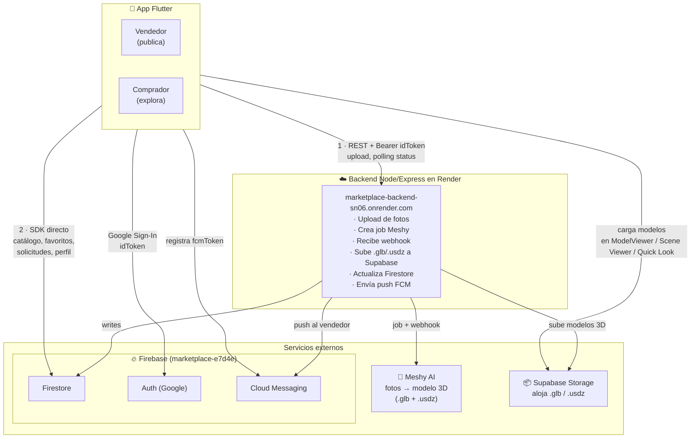
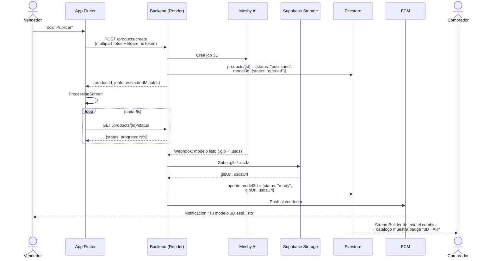

# Arquitectura

## Vista general

> Diagrama editable visualmente: [`architecture.drawio`](architecture.drawio) (ábrelo en [app.diagrams.net](https://app.diagrams.net) o con la extensión "Draw.io Integration" de VS Code).

Hay **dos canales** desde la app:

1. **Backend (REST)** — para acciones que requieren trabajo del servidor (upload de fotos, encolar Meshy, consultar progreso del modelo 3D).
2. **Firebase SDK directo** — para todo lo que es lectura/escritura simple sobre Firestore (catálogo, favoritos, solicitudes de compra, mis productos). Esto evita endpoints triviales y aprovecha actualizaciones en tiempo real con `StreamBuilder`.

## Responsabilidades por capa

### Cliente Flutter

| Capa | Archivo | Responsabilidad |
|---|---|---|
| Entry | `main.dart` | Bootstrap Firebase, construye `MultiProvider`, decide `demoMode` si Firebase no inicializa. |
| Tema | `theme/app_theme.dart` | Material 3, colores, estilos de botones. |
| Modelos | `models/product.dart`, `models/product_listing.dart` | DTOs entre cliente, backend y Firestore. |
| Servicios | `services/*.dart` | Clientes a APIs externas (Dio, FirebaseAuth, FCM, AR launcher, image_picker). |
| Estado | `providers/*.dart` | `ChangeNotifier` por dominio (auth, seller). UI lo consume con `Consumer`/`context.read`. |
| UI | `screens/*.dart`, `widgets/*.dart` | Pantallas y componentes reusables. |

### Backend (Render)

> El backend vive en otro repositorio. Aquí dejamos lo que el cliente espera de él.

Endpoints conocidos:

- `POST /api/v1/products/create` — multipart con `title`, `description`, `price`, `category`, `photos[]`. Devuelve `{productId, jobId, productStatus, estimatedMinutes}`.
- `GET /api/v1/products/{id}/status` — devuelve `{productId, productStatus, status, progress, glbUrl?, usdzUrl?, error?, errorDetail?}`.

Ambos requieren header `Authorization: Bearer <Firebase idToken>`. El cliente lo agrega en `AuthProvider._syncSession` al loguearse.

### Servicios externos

Detalles en [`services.md`](services.md).

- **Meshy AI**: convierte 2-4 fotos en un modelo 3D (`.glb` + `.usdz`) en 1-3 minutos.
- **Supabase Storage**: aloja los archivos `.glb` y `.usdz` resultantes; el backend devuelve URLs públicas que el cliente abre en `ModelViewer` y en Scene Viewer/Quick Look.
- **Firebase Firestore**: catálogo, favoritos, solicitudes, FCM tokens.
- **Firebase Auth**: login con Google.
- **Firebase Cloud Messaging**: push al vendedor cuando el modelo queda listo.

## Flujo de datos del modelo 3D

## Decisiones arquitectónicas

### Por qué Firebase SDK directo para lecturas

Listar catálogo, favoritos y solicitudes son operaciones puramente de lectura/escritura sobre documentos. Pasarlas por el backend duplicaría código sin valor. Usar Firestore directamente nos da:

- **Tiempo real gratis**: `StreamBuilder` sobre `snapshots()` actualiza la UI cuando cambia un doc, sin polling.
- **Menos endpoints**: el backend solo expone lo que requiere lógica de servidor (Meshy).
- **Reglas de seguridad**: la autorización vive en `firestore.rules` (verificar `request.auth.uid`), no en código de aplicación.

### Por qué AR vía deep link, no plugin

`ar_flutter_plugin` y similares fuerzan reimplementar detección de planos, anclaje, gestos, iluminación. Lanzar **Scene Viewer (Android)** y **AR Quick Look (iOS)** delega esa complejidad al sistema operativo. Más detalles en [`ar.md`](ar.md).

### Por qué dos polling sources del modelo 3D

- `SellerProvider._checkStatus` corre mientras el vendedor está en `ProcessingScreen` justo después de publicar.
- `_ArProcessingChip` (en `product_detail_screen.dart`) corre cuando cualquier usuario abre el detalle de un producto cuyo modelo aún no está listo.

Son contextos diferentes y ciclos de vida distintos; se simplifica tener dos pollers desacoplados que el mismo endpoint resuelve.
